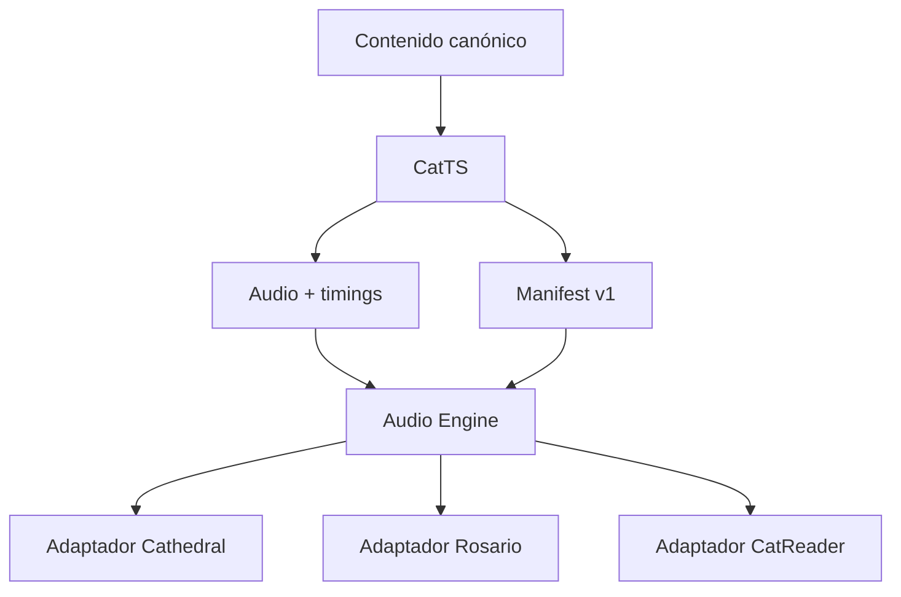

# Cat Audio Engine — especificación v1

Brief de implementación para CatTS, Cathedral, Rosario Cards y CatReader.

## 1. Decisión

Construir una sola plataforma de audio con cuatro piezas:

1. **CatTS genera** audio, capítulos y metadatos de sincronización.
2. **Un contrato JSON versionado** describe obras, pistas, capítulos, ubicaciones y archivos.
3. **Un motor web headless en TypeScript** controla reproducción, cola, loop, progreso y Media Session.
4. **Cada app aporta un adaptador y su propia UI**. No se comparten diseños; se comparte comportamiento.

CatTS no debe estar presente durante la reproducción. Genera artefactos estáticos; las apps sólo leen manifiestos y reproducen archivos.

## 2. Límites

### Incluido

- Audio pre-generado.
- Play, pausa, seek, anterior/siguiente y velocidad.
- Cola editable: reproducir ahora, después, agregar al final, quitar y reordenar.
- Loop de pista o de cola.
- Rutinas/listas guardadas.
- Continuidad entre capítulos o rezos.
- Reanudación después de cerrar o recargar.
- Controles de pantalla bloqueada mediante Media Session cuando el navegador los permita.
- Precarga del siguiente audio y descargas offline opcionales.
- Inicio de CatReader desde la ubicación actual.
- Exportación de audiolibro y subtítulos como artefacto separado.

### No incluido en v1

- TTS del navegador.
- Generación pública y anónima desde las tres apps.
- Edición de texto dentro del reproductor.
- Subtítulos visibles en las tres apps.
- Sincronización entre dispositivos.
- Crossfade, visualizadores o Web Audio API.

## 3. Arquitectura



Recomendación: convertir `catts` en el repositorio central de la plataforma, sin mezclar responsabilidades:

```text
catts/
  contracts/
    audio-manifest.v1.schema.json
    narration-document.v1.schema.json
  packages/
    audio-engine/        # TypeScript, sin React
    audio-engine-react/  # Provider y hooks
  generator/             # backend/CLI CatTS existente
  fixtures/
```

Distribuir el motor como paquete versionado. Para el prototipo puede usarse un workspace local; antes de integrar la segunda app debe existir una versión fijada (`0.1.x`), preferentemente como paquete npm público. Alternativa: dependencia a un tag Git con `dist` ya construido. Nunca copiar el motor manualmente en las tres apps.

## 4. Unidad de audio

No usar una estrategia única para todo:

- **Rosario Cards:** un archivo por oración, meditación o sección lógica. Diez avemarías son diez entradas de cola que apuntan al mismo archivo; no diez MP3.
- **Cathedral:** un archivo por oración, lectura o sección lógica.
- **CatReader:** un archivo por capítulo. Si un libro/PDF no tiene capítulos, crear partes sintéticas de aproximadamente 10–20 minutos.

Esto evita cientos de requests y cortes audibles en libros, pero conserva composición flexible en oración/devociones.

Formato inicial recomendado: MP3 mono. El contrato acepta otros MIME types; el motor no debe acoplarse al codec.

## 5. Contrato CatTS

### Entrada canónica

CatTS recibe bloques con identidad estable. Debe separar el texto mostrado del texto pronunciado:

```ts
type NarrationBlock = {
  id: string;
  displayText: string;
  speechText?: string;
  source: SourceRange;
};
```

`speechText` permite expandir abreviaturas, números o instrucciones de pronunciación sin romper la correspondencia con la app.

### Manifiesto de salida

```ts
type AudioManifestV1 = {
  schemaVersion: 1;
  work: {
    id: string;
    revision: string;
    kind: "prayer" | "devotion" | "book";
    title: string;
    language: string;
  };
  voice: {
    provider: string;
    id: string;
    settingsHash: string;
  };
  assets: AudioAsset[];
  chapters: AudioChapter[];
};

type AudioAsset = {
  id: string;          // identidad semántica estable
  revision: string;    // hash de texto + voz + generador
  src: string;         // URL inmutable
  mimeType: string;
  durationMs: number;
  source: SourceRange;
  timings?: {
    json?: string;
    vtt?: string;
  };
};

type AudioChapter = {
  id: string;
  title: string;
  assetIds: string[];
  source?: SourceRange;
};

type SourceRange =
  | {
      scheme: "block";
      contentId: string;
      startBlockId: string;
      endBlockId?: string;
    }
  | {
      scheme: "epub-cfi";
      start: string;
      end?: string;
    }
  | {
      scheme: "pdf-page";
      startPage: number;
      endPage: number;
    };
```

El JSON de timings es metadato operativo, no subtítulo visible:

```ts
type AudioCue = {
  startMs: number;
  endMs: number;
  source: SourceRange;
  textHash: string;
};
```

El VTT queda disponible para descarga/exportación. Si CatTS hoy sólo produce VTT, el primer paso es comprobar si conserva ubicaciones fuente; no inferirlas por coincidencia difusa salvo como fallback explícito.

### Generación incremental

La revisión de cada asset debe incluir:

1. Texto de pronunciación normalizado.
2. Voz y configuración.
3. Versión del normalizador/generador.

Sólo se regenera lo cuyo hash cambió. Los archivos se publican con URL inmutable, por ejemplo:

```text
audio/<workId>/<assetId>.<revision>.mp3
audio/<workId>/manifest.<revision>.json
```

Publicación atómica: subir audio y timings, validarlos, y recién entonces publicar el nuevo manifiesto. Nunca sobrescribir el archivo que puede estar reproduciéndose.

## 6. Motor web

### Regla principal

Usar **un único `HTMLAudioElement` persistente**, montado en la raíz de la app. No recrearlo al cambiar de ruta o al actualizar React. `HTMLAudioElement` ofrece mejor reproducción de fondo y controles del sistema que Web Audio para voz larga.

### Estado

```ts
type PlayerStatus =
  | "idle"
  | "loading"
  | "playing"
  | "paused"
  | "buffering"
  | "blocked"
  | "ended"
  | "error";
```

`blocked` significa que el navegador exige interacción del usuario. Autoplay autónomo significa: **después de un primer Play**, la cola continúa sola. No prometer reproducción con sonido al abrir la página sin gesto.

### Cola

```ts
type QueueItem = {
  instanceId: string;  // único incluso si el asset se repite
  workId: string;
  assetId: string;
  title: string;
  contextTitle?: string;
  startAtMs?: number;
};

type RepeatMode = "off" | "one" | "queue";
```

La identidad del elemento actual siempre es `instanceId`, no índice ni `assetId`. Así se pueden repetir avemarías, reordenar la cola y mutarla mientras suena sin saltos erróneos.

Operaciones públicas mínimas:

```ts
play();
pause();
seek(ms);
next();
previous();
replaceQueue(items, startInstanceId?);
enqueue(items, "next" | "end");
remove(instanceId);
move(instanceId, targetIndex);
setRepeat(mode);
setRate(rate);
playFrom(workId, sourceLocator);
```

### Políticas

- Precargar el siguiente asset.
- Guardar progreso cada 5 segundos y también en pausa, cambio de visibilidad y fin.
- Reintentar una vez ante un fallo transitorio; luego saltar o detener según política de la app.
- Nunca entrar en loop infinito si todos los assets fallan.
- Ignorar eventos tardíos de un audio anterior mediante un `loadToken`/generación interna.
- Exponer errores legibles; nunca quedar detenido en silencio.
- Coordinar pestañas mediante `BroadcastChannel` o mecanismo equivalente para evitar dos audios simultáneos.
- Integrar `navigator.mediaSession` de forma progresiva; la ausencia de API no es error.

### React

`audio-engine` no depende de React. `audio-engine-react` aporta solamente:

- `AudioEngineProvider` estable en la raíz.
- `useAudioPlayer()`.
- `useAudioQueue()`.
- `useAudioItemState(id)`.

No incluir estilos ni un reproductor visual universal. Se pueden compartir controles accesibles sin estilo si realmente reducen duplicación.

## 7. Cola y rutinas

Separar tres conceptos:

1. **Contenido:** oración, capítulo, lectura.
2. **Cola actual:** ocurrencias concretas que van a sonar.
3. **Rutina guardada:** receta que vuelve a construir una cola.

Acciones visibles y consistentes:

- `Reproducir ahora`.
- `Reproducir después`.
- `Agregar a la cola`.
- `Repetir esta pista`.
- `Repetir la cola`.
- `Guardar como rutina`.

La rutina guarda referencias semánticas, no URLs ni hashes. Al abrirla resuelve siempre la revisión vigente.

## 8. Adaptadores

### Cathedral

- Generar todo por adelantado.
- Cada oración/lectura conserva un `contentId` y `blockId` estable.
- Botón inline de Play y opción de agregar a oración continua.
- Player compacto propio de Cathedral.
- Al agregar o editar contenido, el comando de build exporta textos, llama CatTS y actualiza únicamente assets afectados.

### Rosario Cards

- Generar por adelantado oraciones, misterios y meditaciones.
- El adaptador arma la sesión elegida como una cola de referencias.
- Las repeticiones usan el mismo asset con distintos `instanceId`.
- El elemento actual puede alimentar el resaltado del texto, misterio o cuenta existente; esa integración queda fuera del core.
- Permitir rutinas: rosario del día, un misterio, oraciones favoritas, etc.
- No duplicar lógica de audio dentro de los componentes de cuentas o páginas.

### CatReader

- Un manifiesto por libro y un asset por capítulo/parte.
- Generar los libros existentes por adelantado.
- Para un libro nuevo: priorizar capítulo actual, siguiente capítulo y luego el resto.
- Player persistente con `Escuchar desde aquí`, capítulos, velocidad, timer y descarga.
- Reproducción por defecto: desde la posición actual hasta el final del libro, sin loop.
- Capítulos o libros pueden agregarse a una cola personal si se desea.

## 9. CatReader: página → audio

Una “página” de EPUB cambia con fuente, ancho y dispositivo. No debe ser la clave primaria.

1. EPUB:
   - CatReader pasa el CFI o el identificador del primer bloque visible.
   - El adaptador busca el cue/rango que lo contiene.
   - El motor abre el capítulo y hace seek a `startMs`.
2. PDF:
   - La página sí es estable.
   - Se busca el primer cue de esa página o el cue que la atraviesa.
3. Sin timing exacto:
   - Empezar en el segmento/capítulo más cercano.
   - El resolver devuelve `exact`, `nearest` o `chapter-start`; la UI no debe fingir precisión.

El audio puede emitir cambios de `SourceRange` para que CatReader avance o resalte la lectura. Es opcional en v1; los timings deben conservarse desde el principio para no cerrar esa puerta.

## 10. Persistencia y offline

- Guardar por `workId`: asset, tiempo, locator fuente y revisión conocida.
- Guardar globalmente: cola actual, repeat mode, velocidad y rutina activa.
- Si cambió el manifiesto, reanudar por locator semántico; no por índice viejo.
- IndexedDB para cola, progreso y descargas; fallback pequeño a localStorage.
- Cathedral/Rosario pueden cachearse completos.
- CatReader descarga por libro o capítulo y debe mostrar tamaño antes de confirmar.
- El Service Worker cachea archivos; no es el reproductor ni garantiza ejecución en segundo plano.

## 11. Orden de implementación

### Fase 0 — Auditoría

En los cuatro repos, identificar sin modificar:

- Modelo canónico del texto.
- IDs existentes y estabilidad.
- Player/audio actual.
- Persistencia, PWA y routing.
- API/CLI real de CatTS para capítulos y subtítulos.

Entregar un mapa breve de integración. No rediseñar UI.

### Fase 1 — Contratos

- Crear ambos JSON Schemas.
- Crear tipos TypeScript y modelos Python equivalentes.
- Validar fixtures: una oración breve, una oración repetida y un capítulo con locators.

### Fase 2 — Motor

- Implementar core con transporte de audio inyectable.
- Implementar transporte de navegador, persistencia, Media Session y React bindings.
- Crear una demo mínima con cola editable.
- Tests de estado y Playwright básico.

### Fase 3 — CatTS

- Entrada `NarrationDocumentV1`.
- Generación incremental.
- Audio, timings, VTT y manifest.
- Comando batch idempotente y validador.

### Fase 4 — Piloto Cathedral

Es la integración más simple. Validar paquete, publicación, background, resume y regeneración de una sola oración. Corregir el core aquí, no con forks dentro de Cathedral.

### Fase 5 — Rosario Cards

Validar repetición real, rutinas, cola editable e integración con el estado visual del rosario.

### Fase 6 — CatReader

Validar libros largos, capítulos, generación progresiva, locator→tiempo, descarga y almacenamiento.

## 12. Pruebas obligatorias

### Core

- Diez QueueItems pueden apuntar al mismo asset y avanzar correctamente.
- Reordenar/quitar elementos no cambia accidentalmente el actual.
- `off`, `one` y `queue` terminan donde corresponde.
- Pausar/recargar/reanudar conserva posición.
- Un evento `ended` tardío no salta dos pistas.
- Un asset roto no congela la sesión ni genera loop de errores.
- Un manifiesto nuevo reanuda por locator.

### Integración

- Cathedral: cambiar una oración regenera sólo esa oración.
- Rosario: una decena descarga una sola vez el audio repetido.
- CatReader EPUB: `Escuchar desde aquí` empieza en el capítulo y cue correctos.
- CatReader PDF: una página resuelve dentro de una tolerancia declarada.
- La cola sigue después del primer Play con la pantalla bloqueada cuando el navegador lo soporta.

## 13. Criterios de terminado

1. Las tres apps importan la misma versión del motor; no poseen forks.
2. Los players se ven distintos, pero obedecen la misma máquina de estados.
3. Rosario/Cathedral no llaman TTS durante uso normal.
4. CatReader puede empezar desde la ubicación actual y continuar capítulos.
5. Agregar/quitar/reordenar material del loop es claro y persistente.
6. Contenido repetido reutiliza audio.
7. El sistema sobrevive reload, errores de red y cambios de manifiesto sin perderse silenciosamente.
8. CatTS regenera incrementalmente y publica artefactos inmutables.

## 14. Instrucción maestra para Cursor

> Implementá `CAT_AUDIO_ENGINE_SPEC.md` por fases. Primero auditá CatTS, Cathedral, Rosario Cards y CatReader y escribí un mapa de integración basado exclusivamente en el código real. Conservá modelos y UI existentes. Después implementá contratos y fixtures; no integres apps hasta que el manifiesto valide. Construí el motor como paquete headless versionado, con un solo HTMLAudioElement persistente, transporte testeable y bindings React sin estilos. Hacé de CatTS el productor idempotente de audio, timings y manifiestos. Pilotá Cathedral, luego Rosario y por último CatReader. Todo comportamiento específico debe vivir en adaptadores; si una necesidad de una app parece general, agregala al core con tests. Usá Yarn. No dupliques audio repetido, no uses TTS del navegador, no muestres subtítulos y no prometas autoplay sin gesto. Ejecutá y reportá tests/build/lint en cada fase. Ante IDs inestables, ausencia de locators o discrepancias con esta especificación, detené esa integración, documentá evidencia y proponé la migración mínima antes de seguir.
